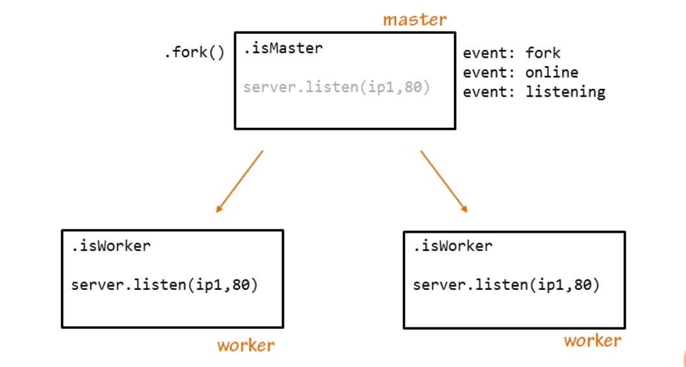

> ## Scaling Node Applications

### Child processes - "child_process"
- node applications don't handle cpu tasks well.
- spending too much cpu time on any one task in a noe app will block the event loop. This will prevent other work from being done. 
- a cpu intensive task can be passed on to a child process and the cpu can continue processing events.
- Four way to launch a child process:
    * spawn(command, [args], [options])
    * exec(command, [options], callback)
    * execFile(file, [args], [options], callback)
    * fork(modulePath, [args], [options])

#### fork()'ing
```javascript
//parent.js
var cp = require('child_process');
var n = cp.fork(__dirname + '/child.js');

n.on('message', function(m){
    console.log('Parent got message: ', m)
});

n.send({ hello: 'world'});
------------------------------------------------
//child.js
process.on('message', function(m){
    console.log('child got message', m)
});
process.send({ foo: 'bar' })
```

> ## "exec" Function
- you can use any unix command in place of 'uptime'.
```javascript
var exec = require('child_process').exec;
var child = exec('uptime', function(err, stdout, stdin){
    if(err){console.log('Error: ' + stderr)}
    else{console.log('Output is: ' + stdout)}
});
console.log('PID is: ' + child.pid);
```

> ## "spawn" Function
- gives more control over stdin, stdout, stderr of the process while its running.
- this is because stdin, stdout, stderr are streams and we can have access to them
while the process is running.
```javascript
var spawn = require('child_process').spawn;
var ps = spawn('ps', ['ax']);   //get list of processes
var grep = spawn('grep', ['node']);     //look for the phrase node

ps.stdout.pipe(grep.stdin);
grep.stdout.pipe(process.stdout);

ps.stderr.on('data', function(data){
    console.log('ps stderr: ' + data);
});

grep.stderr.on('data', function(data){
    console.log('grep stderr: ', + data);
});
```

> ## "fork" Function
- It is built on top of Spawn and it is design to spawn child processes which are also node applications.
- 
```javascript
var fork = require('child_process').fork;

var child = fork(__dirname + '/honorStudents.js');

child.on('message', function(m){
    console.log('The answer is: ' + m.answer);
    child.send({cmd: 'done'});
});

child.send({ cmd: 'double', number: 20 });
---------------------------------------------------------
var evenDoubler = function(v, callback){
  if(v%2 === 0){
    callback(null, v*2);
  } else {
    callback(new Error ("Error right here"));
  }
};

process.on('message', function(m){
    if(m.cmd === 'double'){
        console.log('hs: I was asked to double ' + m.number);
        evenDoubler(m.number, function(err, result){
            process.send({answer: result})
        });
    } else if( m.cmd === 'done') {
        process.exit();
    }
});
```

> ## Node Cluster
- built on top of child_process.fork()
- uses a "Worker" as a class as well as master functions and events.


```javascript
var cluster = require('cluster');
var http = require('http');
var numWorkers = 2;

if (cluster.isMaster){
    //Fork workers
    for(var i = 0; i<numWorkers; i++){
        console.log('master: about to fork a worker');
        cluster.fork();
    }

    cluster.on('fork', function(worker){
        console.log('master: fork event (worker: ' + worker.id + ')');
    });

    cluster.on('online', function(worker){
        console.log('master: online event (worker: ' + worker.id + ')');
    });

    cluster.on('listening', function(worker, address){
        console.log('master: listening event (worker: ' + worker.id + ', pid' + ' '+ worker.process.id + ' ' + address.address);
    });

    cluster.on('exit', function(worker, code, signal){
        console.log('master: exit event (worker: ' + worker.id + ')');
    });
}else {
    console.log('worker: ' + cluster.worker.id + ' id ready');

    var count = 0;

    http.createServer(function(req, res){
        res.writeHead(200);
        count++;
        console.log('working number: ' + cluster.worker.id + ' is incrementing count to ' + count++);
        res.end('hello world from worker number: ' +  cluster.worker.id + ' pid ' + cluster.worker.process.id + ' and the count: ' + count )
        if (count === 3){
            cluster.worker.destroy();
        }
    }).listen(8080);
}
```